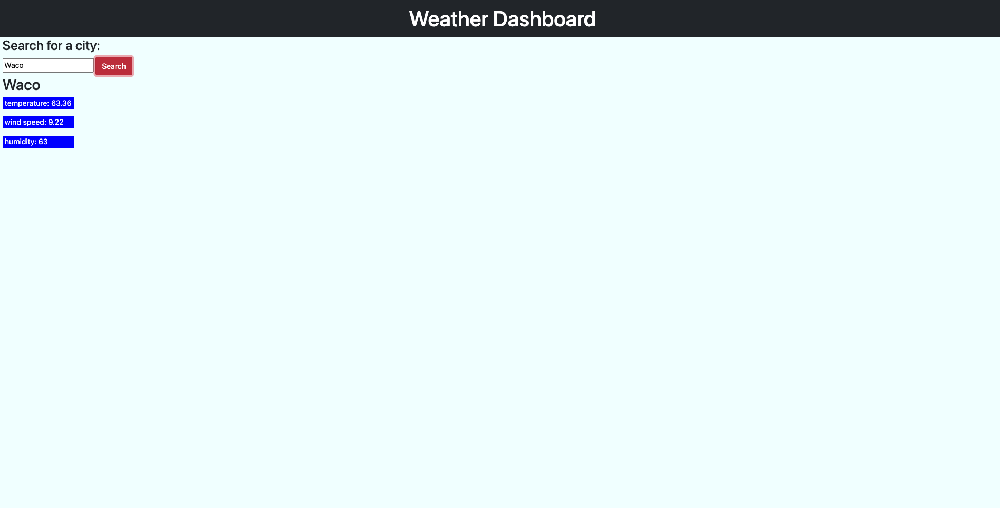

# Weather-Dashboard

## Description
A weather dashboard that will run in the browser and feature dynamically updated HTML and CSS. In this app we called a weather API to get information. This app currently retrieves the current temperature wind speed, and humidity for a city when the user types it in. This API uses the latitude and longitude to find its location.

Future of this project:
At the time of this challenge, I chose to spend time focusing on our Project 1. I came back to this project afterwards and was successful with getting the API call but paused to continue focusing on current class material. I am choosing to stop today (Nov. 29, 2022) for the time being due to the time constraint and two future challenges coming up. I look forward to getting back on this challenge in two weeks!

For future of this application I will be adding the 5-day forecast, adding this to local storage, and adding more styling. 

## Deployment
[Click here]() to see the curent progess of this challenge.

## Credits
---
- Thank you to the UTA-Bootcamp team.
- The Coding Collective
- Private tutor Scott Everett
- Private tutor David Elutilo

## License
---

Distributed under the MIT License. 

